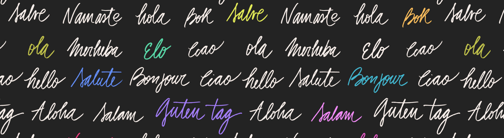

# How To Say "Hello" In Different Languages

| Sr. | Language | Formal | Informal |
|---|---|---|---|
| 1 | French | Bonjour | Salut |
| 2 | Spanish | Hola | ¿Qué tal? (What’s up?) |
| 3 | Russian | Zdravstvuyte | Privet |
| 4 | Chinese | Nǐn hǎo | Nǐ hǎo |
| 5 | Italian | Salve | Ciao |
| 6 | Japanese | Konnichiwa | Yā, Yō |
| 7 | Portuguese | Olá | Oi |
| 8 | German | Guten Tag | Hallo, Hi |
| 9 | Korean | Anyoung haseyo | Anyoung |
| 10 | Arabic | Asalaam alaikum (Peace be upon you) | Ahlan |
| 11 | Danish | Goddag | Hej, Halløj |
| 12 | Swahili | Shikamoo | Habari, Hujambo |
| 13 | Dutch | Goedendag | Hoi, Hallo |
| 14 | Greek | Yassas | Yassou |
| 15 | Polish | Dzień dobry | Cześć, Witaj |
| 16 | Indonesian | Selamat siang | Hallo, Hi |
| 17 | Hindi | Namaste, Namaskar | Hai, Helo |
| 18 | Turkish | Merhaba | Selam |
| 19 | Hebrew | Shalom | Hey |
| 20 | Swedish | God dag | Hej, Tjena |
| 21 | Norwegian | God dag | Hei |


## Follow me at
<a href="https://github.com/iamhitya/"></a> <a href="https://twitter.com/iamhitya/"></a> <a href="https://www.linkedin.com/in/iamhitya/"></a>

## Suggestions / Feedbacks
```
Suggestions & Feedbacks are Most Welcome
hiteshvaghasiya1990[at]gmail[dot]com
```

## Attribution
<a href='https://www.freepik.com/vectors/background'>Background vector created by freepik - www.freepik.com</a>


That's all Folks. Enjoy.